# Path Integration using Coupled Bump Attractors
Arash Sal Moslehian, Ludwig Tiston
2024-05-25

When ants leave their nest in search of food, they often follow complex paths during their scavengings. Research has demonstrated that some ant species possess the ability to navigate back to their nest in a direct line, even after wandering extensively and without relying on landmark cues. This behavior implies that ants have an internal spatial representation or 'memory' that is continuously updated based on their movements. Here, our goal is to create a circuit that can integrate an ant's movements in two dimensions to estimate its position at each time step. To achieve this, we will leverage the stability of bump attractors using Poisson neurons. We start with simulating simple Poisson neurons and managing bump attractors. Following this, we transform the bump attractor into a network capable of integration. Finally, we combine all the components to simulate and decode an agent's trajectory.

# Poisson neurons
Please check out sections 7.2 and 15.3 of the book [Neuronal Dynamics](https://neuronaldynamics.epfl.ch/online/index.html) for more information.
In this project, we will be using Poisson neurons to simulate the neural activity. Their simplicity makes them a great candidate for efficiently simulating large scale population dynamics at the cost of some biological inaccuracies.
We use the following model for simulating the neurons. The potential $h_i$ (in mV) of every neuron $i$ evolves according to the differential equation

$$
\tau \frac{dh_i}{dt} (t) = -h_i(t) + R I_i(t)
$$

where in the remaining we will take $R = 1 M\Omega$. Every neuron has an instantaneous mean firing rate $r_i(t)$ given by the transfer function $g$, for which we will use the sigmoid function

$$
r_i(t) = r_0 g(h_i(t)) = r_0 \frac{1}{1 + e^{-2 \alpha (h_i(t) - \beta)}}
$$

where $\alpha$ and $\beta$ are parameters for tuning the shape of the transfer function, and $r_0 = 1 ms^{-1}$.
In this model the spikes are generated according to a Poisson process, where the probability of having one spike in an interval $[t, t + \Delta t]$ is

$$
P \{ \text{spike in } [t, t + \Delta t] \} = r(t) \cdot \Delta t
$$

### Network parameters.
Unless mentioned otherwise, we will be using the parameters $\alpha = 2 mV^{-1}$, $\beta = 0.5 mV$, $\Delta t = 0.1 ms$, $\tau = 10 ms$.
We start by examining the input-output relationship of the Poisson neurons.

**Ex.0.1**: Plot the transfer function g as a function of the potential h. How do α and β affect the shape?

We can see in
<a href="#fig-ex0-1" class="quarto-xref">Figure 1</a> a) As $\beta$
increases (keeping $\alpha = 2$ constant), the function is shifted to
the right and as it decreases the function moves to the left. In
<a href="#fig-ex0-1" class="quarto-xref">Figure 1</a> b) As $\alpha$
increases (keeping $\beta = 0.5$ constant), the transition gets steeper
and as it decreases, the transition gets less steep.

**Figure 1**
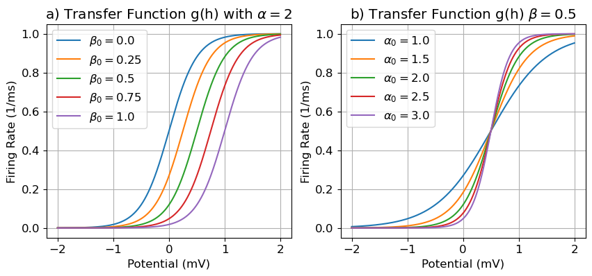

**Ex.0.2**: Simulate the dynamics of $N = 100$ unconnected neurons for $T = 1000$ ms, receiving the slowly oscillating input $I_i(t) = I_0 \sin(\omega t)$ with $I_0 = 2$ nA, $\omega = 10$ rad/s, and with all neurons initialised at $h_i(t = 0) = 0$ mV.

- Compare the mean number of spikes per ms across the $N$ neurons to the instantaneous rate $r = rog(RI(t))$. Explain the difference that you see.
- Now simulate $N = 1000$ neurons. Compare again as before, and explain the difference you see.

<a href="#fig-ex0-2" class="quarto-xref">Figure 2</a> a)
compares the mean number of spikes per ms across the $N$ neurons to the
theoretical instantaneous rate. We can see that the simulated firing
rate is slightly delayed compared to the theoretical rate and has more
fluctuations. As we increase the number of neurons to $N = 1000$ in
<a href="#fig-ex0-2" class="quarto-xref">Figure 2</a> b) we can see the
simulated firing rate is smoother and closer to the instantaneous rate.
The fluctuations arise from the limited amount of neurons, as they
increase the better approximate this mean-field limit. The delay stems
from the timeconstant/scale which the instantaneous rate does not
consider.

**Figure 2**
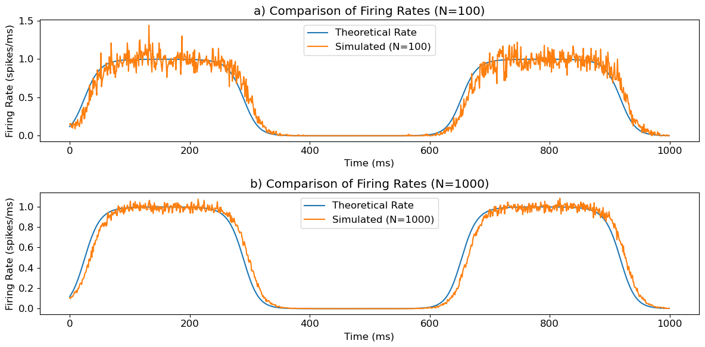

# Bump attractor

**Ex.1.1**: Consider the recurrent network as described above with no external input, and simulate the dy-
namics. This time, take as initial condition for the potential values sampled from the uniform distribution
between 0 and 1: hi(0) ∼ Uniform (0, 1) mV. Produce a raster plot of the activity. What values of J
consistently produce a stable bump in the activity?
Use J = 5 pC to answer the following questions.

In <a href="#fig-ex1-1" class="quarto-xref">Figure 3</a> a)
shows the raster plot of the recurrent network with no external input.
The initial conditions are sampled from $h_i(0) ~ Uniform (0, 1)$ mV.
<a href="#fig-ex1-1" class="quarto-xref">Figure 3</a> b) shows the mean
firing rate of all the neurons for different values of $J$. For
$J > 4.7$ we can consistently get a bump.

**Figure 3**
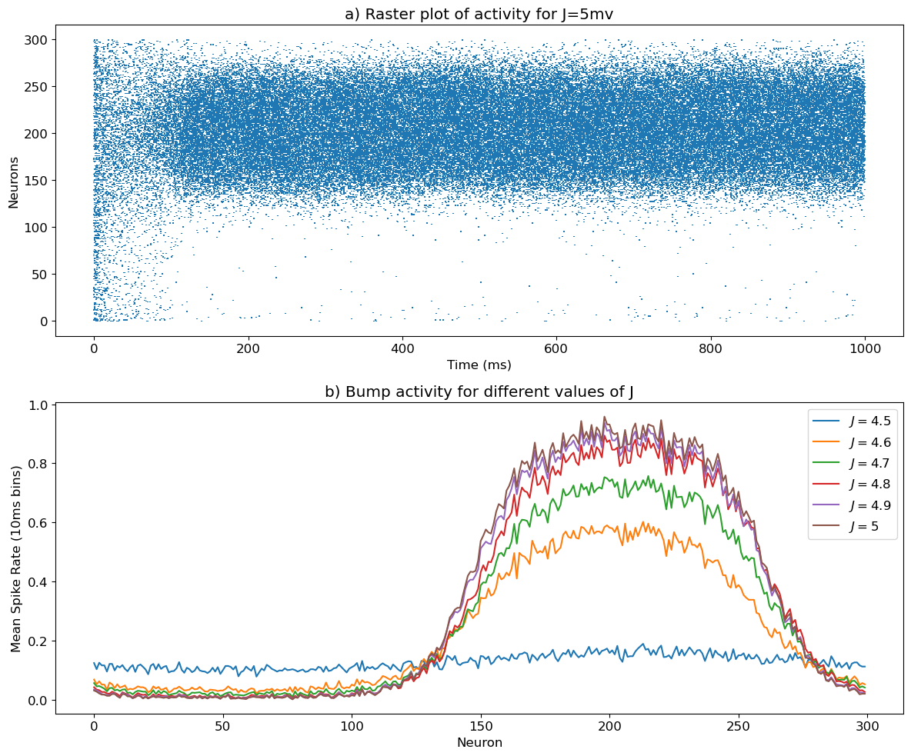

**Ex.1.2**:  Implement a function that can decode the location of the bump θbump over time from the binned
activity. How stable is the location of the bump?

<a href="#fig-ex1-2" class="quarto-xref">Figure 4</a> shows
the location of $\theta_{bump}$ for different values of $dt$. As we
increase the time scale we see the bump drift and move around a bit.

**Figure 4**

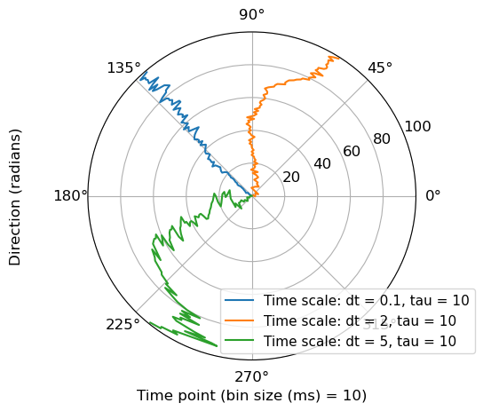

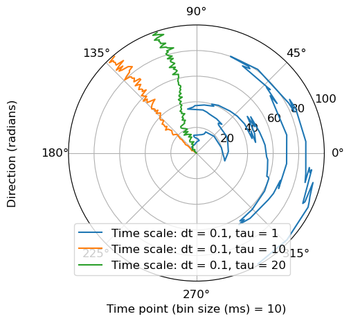

**Ex.1.3**: What causes the location of the bump to drift? In what way can the parameters of the model be
modified to improve this?

The drift in the location of the bump is primarily caused by
the discrete nature and finite size of the network. Increasing $N$ can
provide a more continues approximation of the underlying dynamics and
reduce the drift. Smaller $dt$ makes the integration more accurate and
causes the network to drift less. A smaller timeconstant $\tau$
amplifies these discrete fluctuations further. As seen in
<a href="#fig-ex1-2" class="quarto-xref">Figure 4</a> larger time scales
cause more drift.

**Ex.1.4**:  Simulate the network with the external input described above, and create a rasterplot of the spikes.
What is the effect of the input on the bump? How can this behaviour be explained by looking at the
connectivity profile?

<a href="#fig-ex1-4" class="quarto-xref">Figure 5</a> shows
the result of stimulating the network using the gaussian inputs. These
input create transient increase in the firing rate of neurons that are
around the centers of the inputs. We see increased activity around the
mean of the inputs during the time that they are on. The recurrent
connections will help sustain the bump of activity for some time even
after the external input is removed. The cosine connectivity profile
means that neurons that are spatially close are more strongly connected.
Therefore, an increase in activity at the center of the input will
spread to neighboring neurons due to the recurrent connections.

**Figure 5**
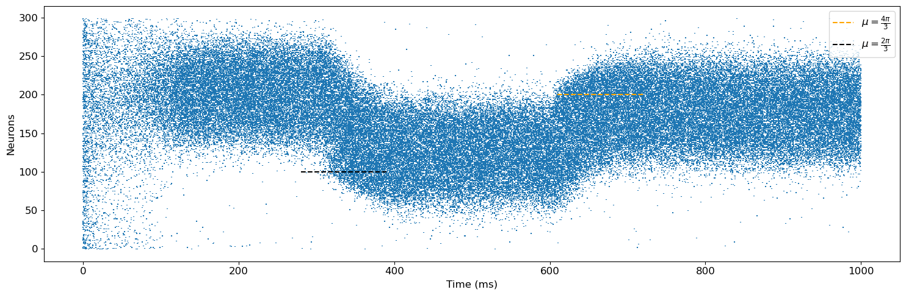

**Ex.1.5**: In the case without external input, what would happen to the bump if the connectivity was instead
given by w(xi − φ, xj ), with φ a small angle? Explain the behaviour you would expect, and verify it
through a simulation.

In <a href="#fig-ex1-5" class="quarto-xref">Figure 6</a> we
see that when a small angle bias is added to the connectivity profile,
the bumps position shifts/rotates over time. As $\phi$ increases, the
frequency of rotation increased. This is as expected, as the neurons are
now stimulated at all times as if there was a bump slightly shifted from
it, so it tried to “chase the shadow” in each timestep.

**Figure 6**

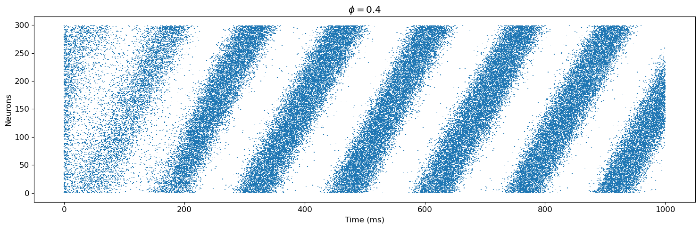

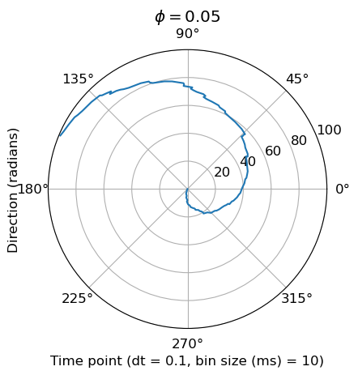

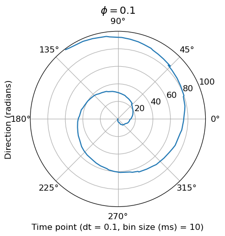

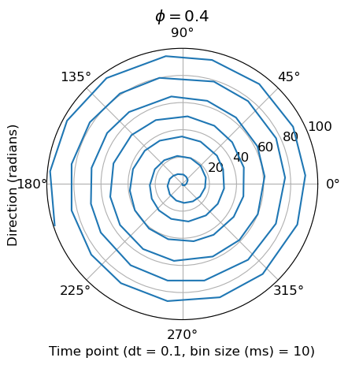

**Ex.1.6**:  Above we have used a ring model with a wide tuning curve per neuron, as it is the easiest
to implement. Can you implement a bump attractor with similar behaviour using a gaussian tuning curve? Find parameters J0 , J1 and σ for which you can get a stable bump. Do you notice any effects from switching from a ring model to a line model?

<a href="#fig-ex1-6" class="quarto-xref">Figure 7</a> shows
the raster plot for bump attractor model using the gaussian tuning curve
for $N = 100$ neurons and $T = 300$ ms as the simulation is
computationally intensive. We also added a small $\phi = 0.2$ like the
previous case to easier see the behaviour of the bump near the edges.
From the lectures we know we want a connectivity profile that is like a
“mexican hat”. That is exitation close, inhibiton further away, and
close to no interaction even further. The values
$J_0=-2, J_1=4.5, \sigma=1$ fit this description and does generate a
stable bump. The periodic nature of the ring model eliminates any
boundary effect. For the line model, the two ends of the simulation
space are not connected as in the the ring model. This has the effect
that the bump gets stuck as the edge, instead of wrapping around.The
bump cannot move further to the edge as there aren’t enough neurons to
stimulate it in that direction. We can see that with a small $\phi$ the
bump is stuck at the edge and does not wrap around like in
<a href="#fig-ex1-5" class="quarto-xref">Figure 6</a>.

      0%|                                                                                                                        | 0/4999 [00:00<?, ?it/s]100%|█████████████████████████████████████████████████████████████████████████████████████████████████████████████| 4999/4999 [00:53<00:00, 92.73it/s]

**Figure 7**
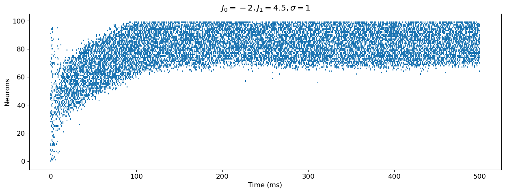

# Integration

In this second part, we will combine two offset bump attractors together to form a circuit capable of
integrating a variable. For this, we make two copies of the circuit from above which we will call the left
(L) and the right (R) population.

**Ex.2.1**: Write down the equation of the full input received for each neuron in both of the populations, in
terms of four collective variables. Without simulating the network, explain how this connectivity can be
considered a “push-pull system” in the stable configuration

Equation
<a href="#eq-ex2_1" class="quarto-xref">Equation 1</a> shows the
equation of the full input received for each neuron in both populations.
The push-pull system is formed as the result of two opposing “forces” in
balance, acting on each population/bump. The phase shift $\theta$ is
pushing it in one direction, but the stimulation from the other neuron
population is pulling it in the other direction (through the weights
$w_{R \rightarrow L}$ and $w_{L \rightarrow R}$).

When one population is externally excited it pushes the neurons in its
population by exciting them and pulls on the neurons in the other
population by inhibiting them. Also, when its bump moves in a certain
direction, and the other population experiences an inhibitory effect
that pulls its bump in the opposite direction. This mutual inhibition
and excitation dynamic results in a stable configuration where the
network can robustly integrate and represent a variable.

$$
\begin{aligned}
I_{left,i} &= \frac{J}{N} (\sum_{j=1}^{N} w_{L \rightarrow L}(x_i^L, x_j^L)S_j(t)\\
&+ \sum_{j=1}^{N} w_{R \rightarrow L}(x_i^L, x_j^R)S_j(t)) + I_{ext,i}\\
I_{left,i} &= \frac{J}{N} (\sum_{j=1}^{N} cos(x_i^L+\theta - x_j^L)S_j(t)\\
&+ \sum_{j=1}^{N} cos(x_i^L + \theta - x_j^R)S_j(t)) + I_{ext,i}\\
I_{left,i} &= J((cos(x_i^L+\theta)m_{cos_L}(t)+sin(x_i^L+\theta)m_{sin_L}(t))\\
&+ (cos(x_i^L+\theta)m_{cos_R}(t)+sin(x_i^L+\theta)m_{sin_R}(t))) + I_{ext,i}\\
I_{right,i} &= J((cos(x_i^R-\theta)m_{cos_R}(t)+sin(x_i^R-\theta)m_{sin_R}(t))\\
&+ (cos(x_i^R-\theta)m_{cos_L}(t)+sin(x_i^R-\theta)m_{sin_L}(t))) + I_{ext,i}\\
\end{aligned}
 \qquad(1)$$

**Ex.2.2**: Test the stability of the combined circuit. For this, use θ = 10◦ , J = 3 pC, and randomly initialised
potentials hi (0) ∼ Uniform (0, 1) mV. Plot the location of the two bumps θbump L/R over time. How
stable is this configuration?

<a href="#fig-ex2-2" class="quarto-xref">Figure 8</a> shows
the location of the bump for the left and right population with randomly
initialized potentials and $\theta = 10^{\circ}$ and $J = 3$ pC.

**Figure 8**
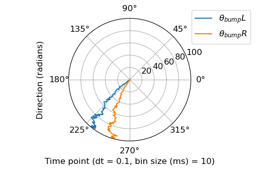

**Ex.2.3**:  Find a way to initialise the potential hi(t = 0) such that the mean location of the two bumps is at
θbump mean ≈ π. This will be helpful later on for decoding the displacement

The bump-position of the two populations, and their mean,
can be seen in <a href="#fig-ex2-3" class="quarto-xref">Figure 9</a>.
Their mean has been initialised at $\pi$ This is done by initialising
the two membrane potentials with noisy square-waves slightly offset from
$\pi$. A slight drift can be seen over time.

**Figure 9**
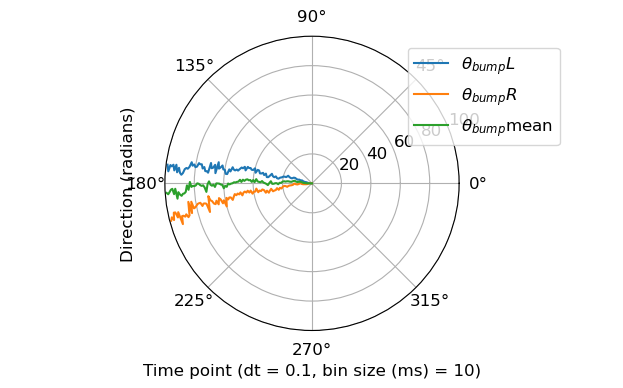

**Ex.2.4**: Take I0 as varying from -1.5 to 1.5 nA in 51 steps. Simulate the dynamics and plot the final
location θbump mean as a function of the input strength I0 . What would be a good upper limit on the
input strength such that the relation between I0 and the final bump location is linear?

<a href="#fig-ex2-4" class="quarto-xref">Figure 10</a> shows
the final location $\theta_{bump} \text{mean}$ for different values of
$I_0$. An upper limit on $I_0$ that keeps the bump in a linear regime
would be $I_0 \leq 0.47$ nA.

**Figure 10**
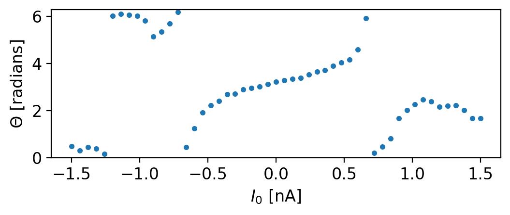

**Ex.2.5**:  Explain how this system of coupled bump attractors can be seen as a system for integration of the
input.

This system of coupled bump attractors can be viewed as a
mechanism for integration of input due to its ability to represent and
maintain a stable state that integrates information over time. Each
population of neurons encodes a bump that represents a specific value or
variable, and the connectivity between the populations enables the
integration of these representations. External inputs can perturb the
bumps, causing them to shift left or right, effectively updating the
integrated variable. The mutual inhibition and excitation between the
populations ensure that the system maintains equilibrium and integrates
the input information, making it suitable for tasks requiring continuous
integration and updating of variables.

# Path integration

**Ex.3.1**: Write a method for generating a smooth random trajectory in 2D with constant speed, and
implement it as a function. The function should return both the head direction θH (t) and 2D position
for every time step. Explain your choice of implementation.

The function creates a smooth random 2D trajectory with
constant speed by incrementally updating the position and heading
direction at each time step. The `step_size` ensures a uniform distance
per step, while the `max_angle` parameter limits changes in the heading
direction to avoid abrupt turns, ensuring smoothness. Starting from an
initial position and heading, the function updates the position using
trigonometric functions based on the current heading, which is gradually
adjusted with small random perturbations.

**Ex.3.2**:  Simulate the head direction cells and produce a plot of the bump location θbump H against the current
head direction θH . Does it match well?

<a href="#fig-ex3-2" class="quarto-xref">Figure 11</a> shows
the results of simulating the head direction cells $\theta_{bump}^H$
againts the current head direction $\theta_H$. The plot shows a strong
correlation. This close match between the two, indicates that the head
direction cells accurately track the actual head direction,
demonstrating the effectiveness of the bump attractor network in
integrating and representing head direction. Any significant mismatches
could suggest that the turning speed in the trajectory generation was
too fast, causing the neural network to lag.

**Figure 11**
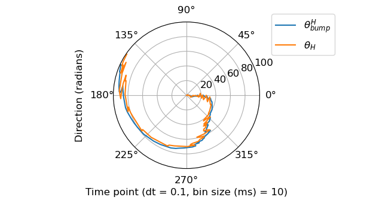

**Ex.3.3**:  Find a value of Jhead such that the total input coming from the head direction cells to the two
populations always stays in the linear regime, as found in Question 2.4.

<a href="#fig-ex3-3" class="quarto-xref">Figure 12</a> shows
the values of $J_{head}$ againts the maximum current of the head
population to the other two couple attractors. Values of $J_{head}$
close to $0.9$ pC give rise to an input around $0.47$ nA which as we saw
in <a href="#fig-ex2-4" class="quarto-xref">Figure 10</a> puts the
system in a linear regime.

**Figure 12**
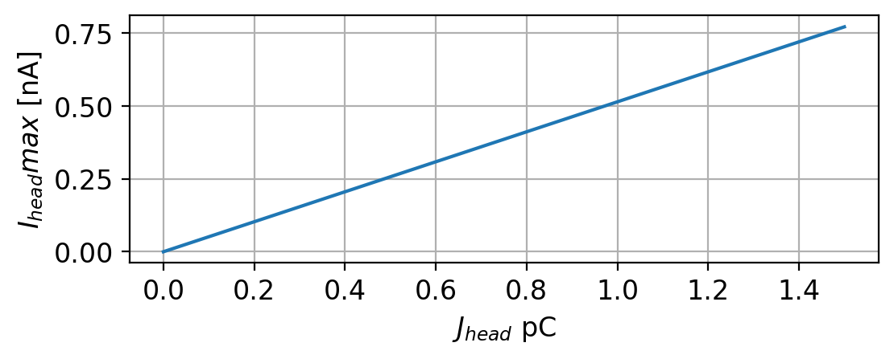

**Ex.3.4**:  Write down the equations for the input that is received by each of the five populations.

Equation
<a href="#eq-ex3_4" class="quarto-xref">Equation 2</a> shows the
equations for the input that is received by each of the five
populations.

$$
\begin{aligned}
&I_{head, i} = I_0 cos(x_i^H - \theta_H(t)) \\
&I_{left, i}^{x} = \frac{J}{N} (\sum_{j=1}^{N} cos(x_i^L+\theta - x_j^L)S_j(t)  \\
&+ \sum_{j=1}^{N} cos(x_i^L + \theta - x_j^R)S_j(t))  + \frac{J_{head}}{N}(\sum_{j=1}^{N} -cos(x_j^H)S_j(t))\\
&I_{right, i}^{x} = \frac{J}{N} (\sum_{j=1}^{N} cos(x_i^R-\theta - x_j^L)S_j(t) \\
&+ \sum_{j=1}^{N} cos(x_i^R - \theta - x_j^R)S_j(t)) + \frac{J_{head}}{N}(\sum_{j=1}^{N} cos(x_j^H)S_j(t))\\
&I_{left, i}^{y} = \frac{J}{N} (\sum_{j=1}^{N} cos(x_i^L+\theta - x_j^L)S_j(t)  \\
&+ \sum_{j=1}^{N} cos(x_i^L + \theta - x_j^R)S_j(t))  + \frac{J_{head}}{N}(\sum_{j=1}^{N} -sin(x_j^H)S_j(t))\\
&I_{right, i}^{y} = \frac{J}{N} (\sum_{j=1}^{N} cos(x_i^R-\theta - x_j^L)S_j(t) \\
&+ \sum_{j=1}^{N} cos(x_i^R - \theta - x_j^R)S_j(t)) + \frac{J_{head}}{N}(\sum_{j=1}^{N} sin(x_j^H)S_j(t))\\
\end{aligned}
 \qquad(2)$$

**Ex.3.5**:  Simulate the activity of the network for the whole trajectory. Decode the activity from your
two position integrators using a linear fit, and make a plot showing both the original and the decoded
trajectory on top of each other.

<a href="#fig-ex3-5" class="quarto-xref">Figure 13</a> shows
the simulation of the network with $N = 300$ number of neurons and for
$T = 1000$ miliseconds for the whole trajectory. The decoded trajectory
(using a linear fit on the portion of data without the initial transient
activity) is shown on top of the original trajectory. The imperfections
in the decoded trajectory could be attributed to drifts, noise, and
inaccuricies in the integration at are inherent to the simulation. The
following parameters could be change to make the network perform
bettter: 1) Decreasing the maximum angle change per step can reduce the
likelihood of abrupt turns. 2) Increasing the number of neurons in the
network can enhance the resolution and precision of the bump attractor.
3) Reducing noise in the system, either by modifying the spike
generation mechanism or by using noise suppression techniques, can lead
to a clearer signal and better decoding performance. 4) Reducing the
step size can ensure that the head direction changes more smoothly and
slowly, allowing the neural network to better track these changes and
integrate the trajectory more accurately.

**Figure 13**

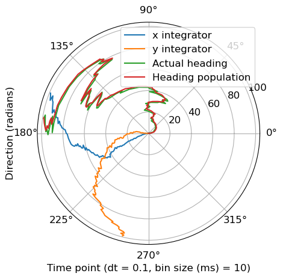

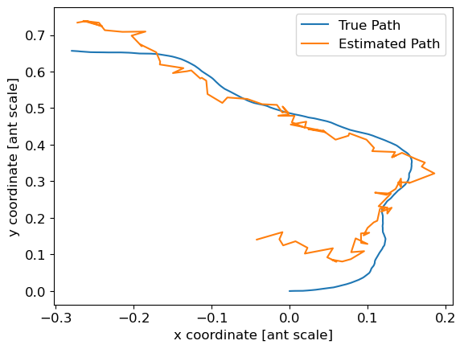

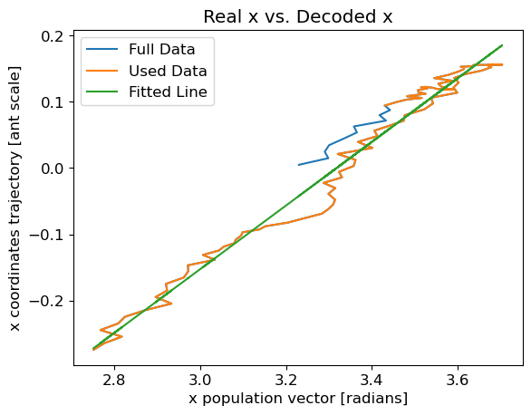

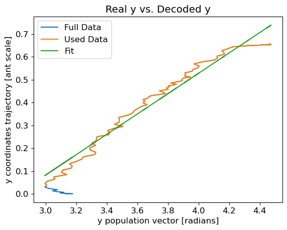

**Ex.3.6**:  Could this integrator circuit be a biologically realistic model of path integration for insects such as
ants? Explain how the different aspects of the model are realistically feasible or not.

While the simplified network that we are using aids in
computational modeling, real insect neural circuits might involve more
complex interactions and dynamics. Moreover, we are using a model with
fixed parameters but insects may have adaptive mechanisms to fine-tune
these parameters based on sensory feedback and environmental conditions.
The model spatially limited as well, as it wraps around when integrating
more than $\pi$, while the “physical ant” does not.

**Ex.3.7**:  It’s time to push the model to its full potential. Simulate a larger network (N ≥ 1000)
capable of accurate decoding of a longer path (T ≥ 3 s). Feel free to tune other parameters as desired.

<a href="#fig-ex3-7" class="quarto-xref">Figure 14</a> shows
the performance of the network with $N = 2000$ number of neurons and for
$T = 4000$ miliseconds. The estimated trajectory is now more accurate
and smoother.

**Figure 14**

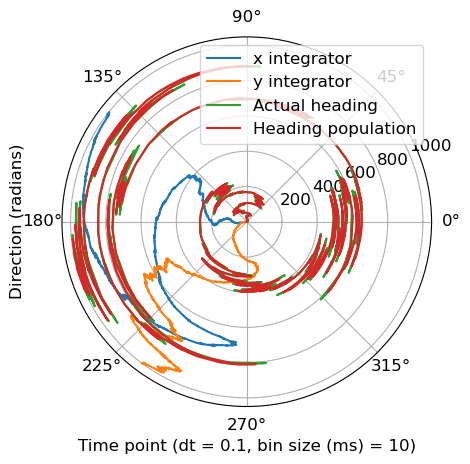

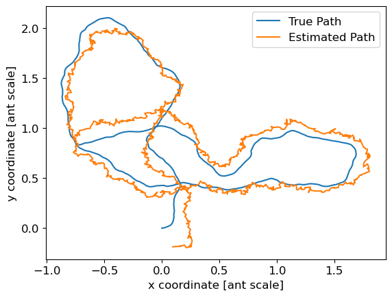

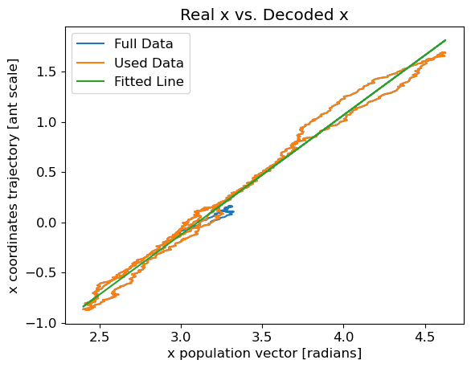

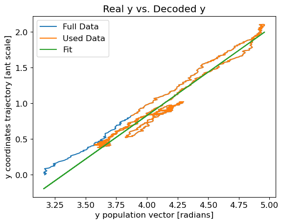

